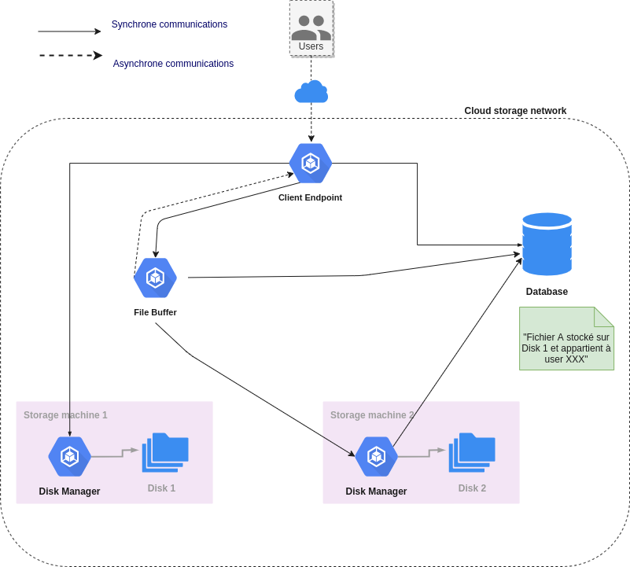

# What is Cloud-storage ?

Welcome to our brand-new file storage system, accessible from anywhere, just like a standard file sharing system. 

It can be easily installed and configured on any server, so it is you who manage and owe your data.

It is scallable by design and can manage limitless amount of disks located on a network. 

# Run backend

## requirements

* docker
* docker compose extension v3 or superior
* ansible v2.13 or superior

```
sudo mkdir /cloud-storage && sudo chown {linux-user}:{linux-user} /cloud-storage
cd {cloud-storage-repo}/server/ops/ansible
ansible-playbook install-requirements.yml -i inventory.yaml --limit {target-machine}
```

with: 
- {linux-user} your linux username
- {cloud-storage-repo} path of Cloud storage repo on your machine
- {target-machine} *localhost* or *iofactory.fr*

## let's start Cloud-storage

Deploy database
```
cd {cloud-storage-repo}/server/ops/ansible
ansible-playbook init-mysql.yml -i inventory.yaml --extra-vars "repo_root_path={cloud-storage-repo} mysql_username={mysql-username} mysql_password={mysql-password}" --limit {target-machine}
```

Build and deploy services
```
cd {cloud-storage-repo}/server/ops/ansible
ansible-playbook build-and-deploy.yml -i inventory.yaml --extra-vars "repo_root_path={cloud-storage-repo} mysql_username={mysql-username} mysql_password={mysql-password} disk_name={disk-name}" --limit {target-machine}
```

## services configuration

directory tree :

```
/cloud-storage
├── clientEndpoint
│   └── conf
│       ├── mysql.yaml
│       └── server.yaml
└── diskManager
    ├── conf
    │   └── mysql.yaml
    └── disk
        ├── data
        ├── disk-info.conf
        └── files
```

disk-info.conf must only contain one string which is the default disk name.


## clean data

Stop and clean database data
```
cd {cloud-storage-repo}/server/ops/ansible
ansible-playbook init-mysql.yml -i inventory.yaml --extra-vars "trigger_action=clean_data" --limit {target-machine}
```

# Swagger

start it running this command
`docker run -d -p 7000:8080 -e SWAGGER_JSON=/openapi/swagger.yaml -v {cloud-storage-repo}/server/doc:/openapi swaggerapi/swagger-ui`

then you can access it on `http://localhost:7000`

# Architecture

